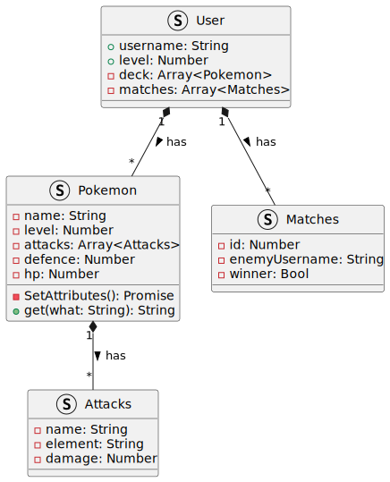

# i found my lord and my savior: GUN
## GUN IS LOVE, GUN IS LIFE, GUN IS PERFECTION, GUN IS PEAK FICTION

### PROJECT UML:

## TODO:
- [X] Write the pokemon Obj (done in testing/class pokemon.js) 
- [X] Debug 
- [ ] Write the attacks array? (optional)
- [ ] Write the user logic and auth 
- [ ] Debug 
- [ ] Merge User and pokemon 
- [ ] Debug 
- [ ] Write gun logic and querying 
- [ ] Debug 
- [ ] Write Battle logic 
- [ ] Debug 
- [ ] Release 
 